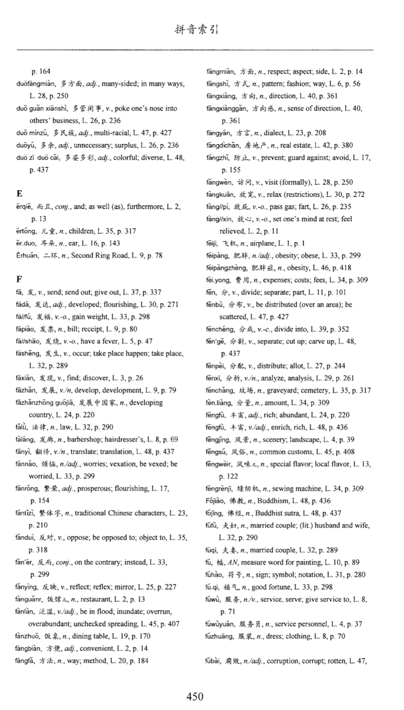
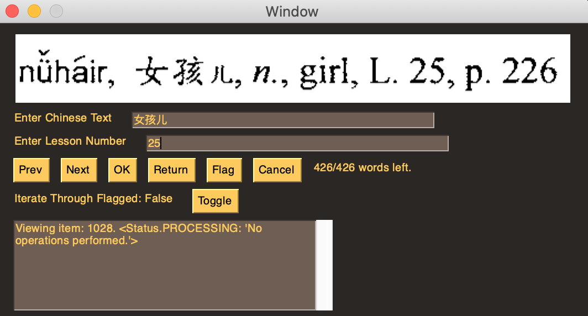

# OCR Flashcard Creation

Every Friday, I would sit down in the classroom and take a test that assessed my knowledge of the week's vocabulary and grammar patterns. These were by and large were derived from a new chapter in the textbook *A New China: An Intermediate Reader of Modern Chinese.* I used an app called Pleco (which I highly recommend for anyone studying Chinese) to create, organize, and test flashcards. The process was relatively simple: create a folder for that week's vocab, and then iteratively type in each word I saw in my textbook into the Pleco search bar, adding each corresponding entry to the folder. However, with around 40 words per chapter and 50 chapters, the manual labor added up. So I decided to see if I could obtain the entries from a PDF version of the textbook and import them to the app. The problem here was that the PDF was unable to decode the chinese characters, and the pinyin detection was often flawed. So I created this python application that can automate the detection of as many words as possible, while allowing me to manually type in the correct values in unsuccessful detection through a simple GUI interface.

Here is a general overview of the pipeline:

## Pipeline ## 

1. Parsing: parse pdf into word objects with useful metadata, e.g. bounding boxes, page number etc.
2. Visualization: iterate over words and visualize text
3. OCR: perform OCR on text using multiple detectors
4. Refinement: use custom heuristics to aggregate OCR output
5. Classification: determine if text can be classified with high enough probability
6. Assignment: assign to successful or unsuccessful buckets and save info 
7. Custom Assignment: unsuccessful words will be manually assigned using a GUI
8. Finalization: All assigned words (plus custom modifications) are included as flashcards in a text file
9. Data Import: Flashcard text file is imported into Pleco App

Operations 1-6 were performed in *OCR.py*, 7 was performed in *GUI.py*, and 8 was performed in *combine.py*. 

## Parsing ## 

Using the Fitz module, I was able to examine the PDF metadata. Chapters in the book were structured where some text was at the top, and below some demarcation line, Chinese vocabulary words were then matched to their corresponding pinyin, grammatical info, and english translation. However, finding this line was not a trivial task as it not particularly standardized in its location. Moreover, each chapter would often have a few redundant pages so parsing through these to determine whether or not it's a valid vocab page didn't seem like the best use of my time. Instead, I relied on the vocabulary index towards the end of the PDF. This index was ordered alphabetically by pinyin, and contained the associated characters, english translation, and chapter number. The PDF also provided bounding boxes around each new entry (these weren't perfect but were generally pretty good), making it possible to iterate over the entries on each page. 

I've provided an image for one page in the textbook's index. This shows that it is fairly well-structured, and one can imagine splitting items along the horizontal axis into five categories: left (start of a word), center-left (continuation of a word), center (title/page number), center-right (start of a word), right (continuation of a word). And so I clustered the bounding boxes in this manner, assigning them numbers from 0 to 4. A **block** was an object that stored this bounding box, cluster number, page number, text (from the internal PDF OCR), and a unique block id. So you can imagine a block would correspond to each new line of the page (differentiating between left and right sides of the page). A **group** was essentially a grouping of related data *on the same page*. The **group** object would store a list of included block ids, the page number, the concatenated text, a bounding box that was a union of all included bounding boxes, and a unique group id. At the top of the hierarchy was a **word** object, which was essentially just a list of groups across different pages (or a singleton list if the word was represented in the same page) and a unique word id. The parsing step mostly performed this aggregation, alongside a few other small steps described in later sections of the pipeline. 

## Visualization ## 

This was a relatively simple step that just invovled iterating over the grouped **word** objects and converting the bounding box data (stored as rectangle coordinates) and page number to an image. Some small alterations were performed, such as expanding a bounding box corners, since they were generally pretty tight and occasionally clipped text. I also cached page images that I'd encountered as loading these using Fitz was fairly time consuming. If the **word** contained multiple groups, results from these would also be merged later for the refinement step. 

## OCR ## 

I used four different tesseract pre-trained OCR detectors, a cartesian product of English/Chinese detectors and Single-Line/Multi-Line detectors. This allowed me to glean various kinds of data. Obviously, the single-line vs multi-line detectors worked best on those types of input (only one of these was run and this was determined by the kind of input I had). And obviously, the Chinese detectors worked best on Chinese characters. However, I found that sometimes the English detector worked better for pinyin and sometimes the Chinese detector worked better. The English OCR also worked better for detecting numerical characters.

## Refinement/Classification ## 

I used the structure of the entries (in order: pinyin, characters, word type, translation, lesson number, page number) to extract the pinyin, characters, and lesson number from the OCR detectors. I used some fairly simple heuristics to increase the probability of a successful match, which I used through a refinement pipeline. First, I converted the chinese characters to corresponding pinyin (no tones). I extracted 'er' or 'r' letters at the end as these are generally redundant in Chinese and increase problem complexity. In the parsing step, I had mapped each block id to a letter (well, I only mapped the first block id that began with a new letter as they were processed in alphabetical order, but this was effectively the same thing). I then checked to see if the character to pinyin conversion started with the expected letter. If the word was properly ordered and the OCR prediction scores for each character in the word were greater than a certain threshold, this would be a success. If the word was properly ordered and the converted char-to-pinyin matched one of the english/chinese detected pinyin, this would also be considered a success. If that didn't work, I tried removing a chinese character at the start or end of the detected OCR (or both) and checked if this helped -- this change was implemented that the OCR detector would often add an unnecessary chinese character to the string. Otherwise, the entry was unsuccessful.

## Assignment ## 

If a **word** was deemed successful after the refinement step and a valid lesson number could be detected, it was added to a dictionary that mapped lesson number to vocab words. Otherwise, the **word** was saved for manual processing. The success rate of the OCR was 78% (~1495/1921 words). 

## Custom Assignment ## 

I created a GUI based on PySimpleGUI that visualized the bounding boxes of the remaining words and allowed you to enter the corresponding chinese characters to save the entry. If the bounding box was too confusing to process (for instance, sometimes it would include two words due to the PDF not properly separating bounding boxes), you could flag the entry for later processing. You were able to iterate through unprocessed words, flagged words, or simply go to an adjacent entry. All user data would be saved on the fly in case the GUI were to suddenly close. 

## Finalization ## 

The results of the successful entries and unsuccessful entries were then joined together in a final combination step. Assessments made from flagged entries could also be added directly into the code once I made the determination of what the word was and where it belonged. Together, these lesson to vocab list key-value pairs were formatted into a format that Pleco understood during data import and appended to a text file. 

## Data Import ## 

This was done really easily through a web url Pleco provided for importing the text file. 
